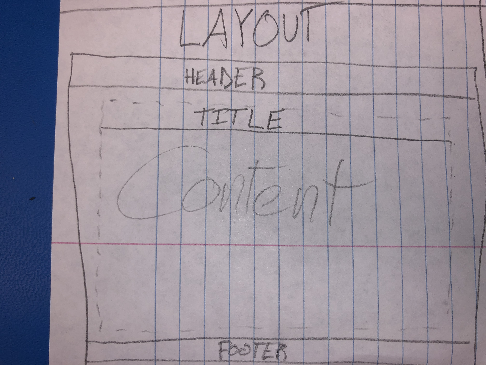
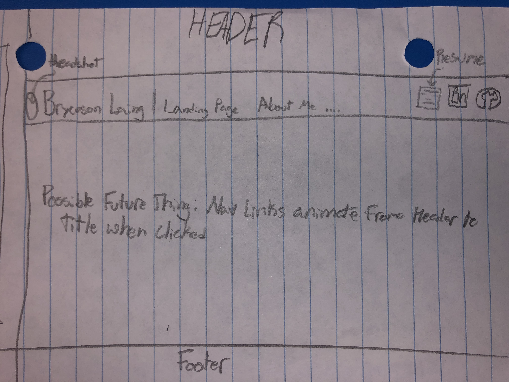
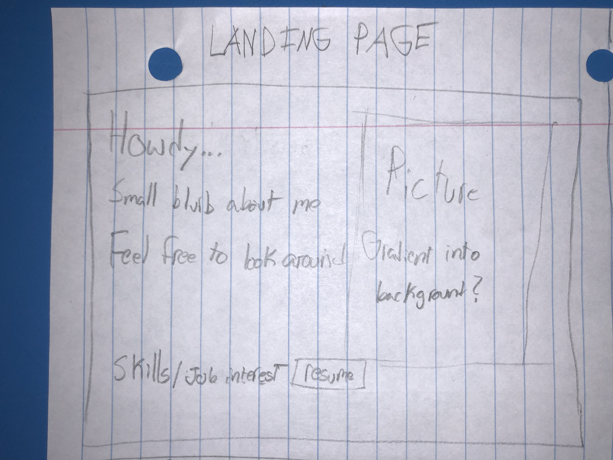
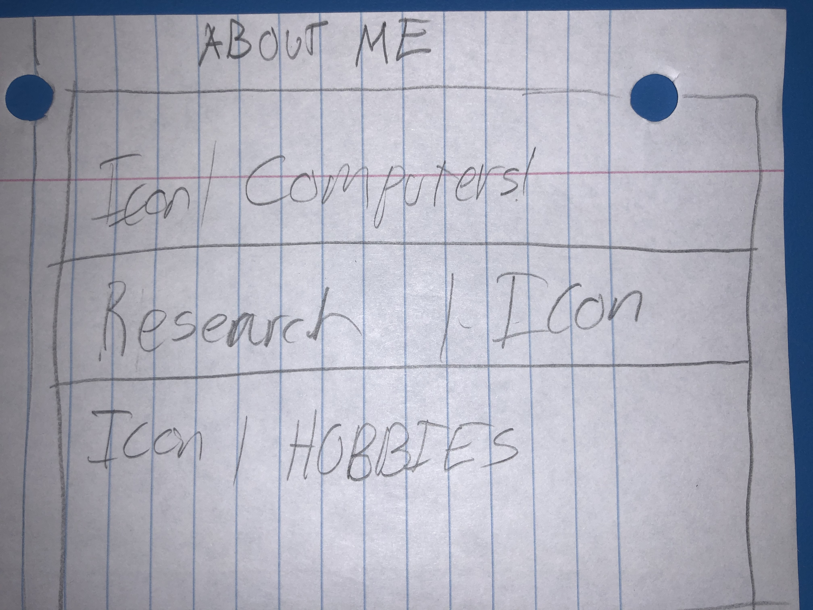
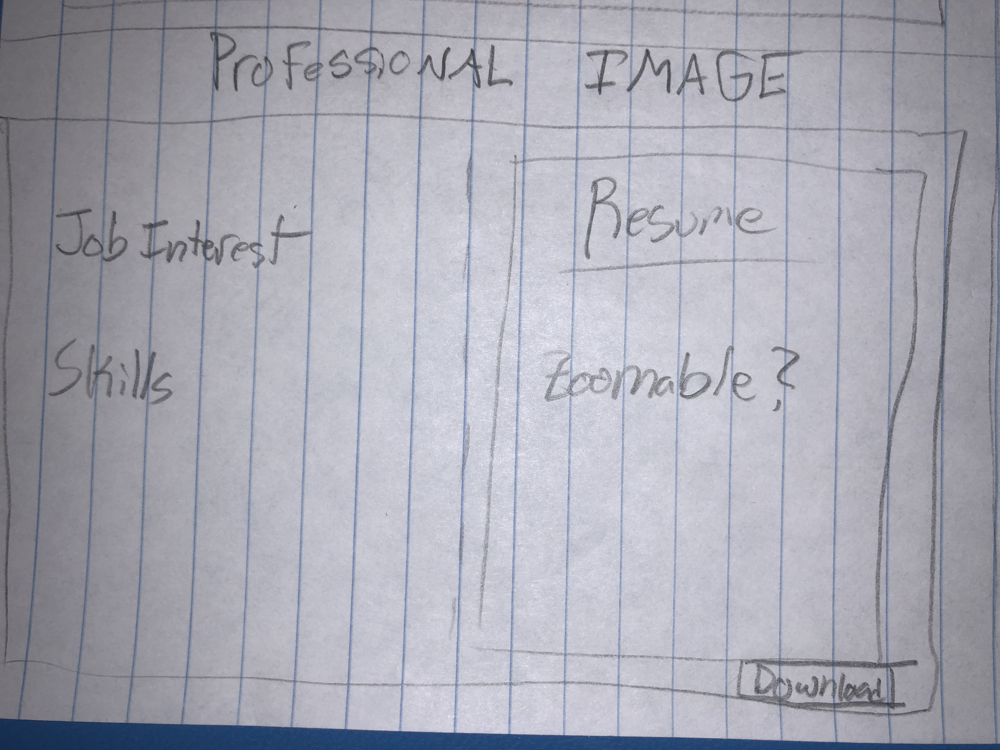
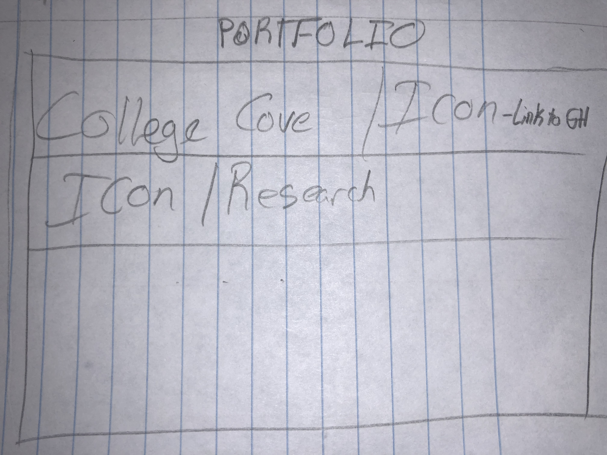
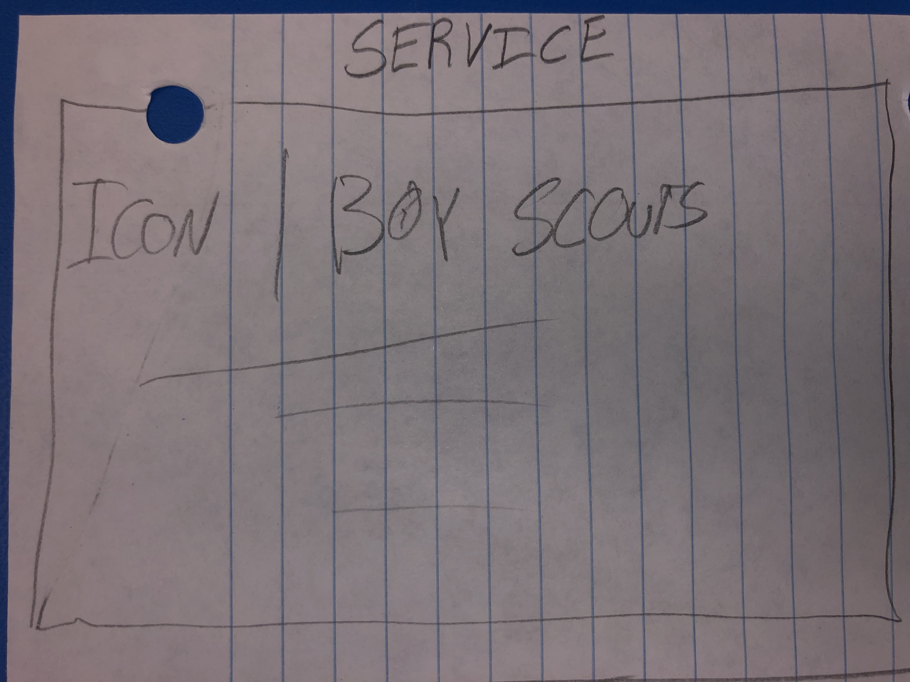

# Design Document

_Bryceson Laing's personal website for CSCE 315_

## Project Goal
_Have a professional portfolio in place to share information about myself_

## Project Details
_I am creating and publishing a web page to people.tamu.edu_

#### It will contain:

  - **Pages**
    - [ ] Landing page
    - [ ] About me
    - [ ] Professional image _(300 word minimum)_
    - [ ] Portfolio _(300 word minimum)_
    - [ ] Service
  
  - **Header**
    - [ ] My headshot
    - [ ] My name
    - [ ] Navigation to every page
    - [ ] Links to my resume, [LinkedIn](https://www.linkedin.com/in/brycesonlaing/), and [GitHub](https://github.com/bklaing2/)
  
  - **Footer**
    - [ ] My name
    - [ ] Links to my resume, [LinkedIn](https://www.linkedin.com/in/brycesonlaing/), and [GitHub](https://github.com/bklaing2/)
    
  - **At least 10 links to external websites**
    - [ ] [LinkedIn](https://www.linkedin.com/in/brycesonlaing/)
    - [ ] [GitHub](https://github.com/bklaing2/)
    - [ ] [Texas A&M](https://www.tamu.edu/)
    - [ ] [Embedded Signal Processing Lab](https://jafari.tamu.edu/)
    - [ ] [tamusic club](https://stuactonline.tamu.edu/app/organization/profile/public/id/1763)
    - [ ] [Big Event](https://bigevent.tamu.edu/)
    - [ ] [Boy Scouts](https://www.scouting.org/)
    - [ ] [deCasa](https://decasamusic.com/)
    - [ ] ...
    - [ ] ...

## Mockups

#### Layout

#### Header

#### Footer

#### Landing Page

#### About Me

#### Professional Image

#### Portfolio

#### Service

