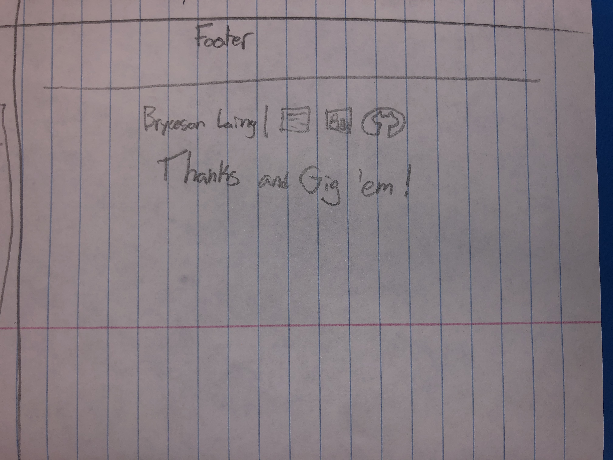

# Design Document

_Bryceson Laing's personal website for CSCE 315_

## Project Goal
_Have a professional portfolio in place to share information about myself_

## Project Details
_I am creating and publishing a web page to people.tamu.edu_

#### It will contain:

  - **Pages**
    - [x] Landing page
    - [x] About Me
    - [x] Technical Skills _(300 word minimum)_
    - [x] Portfolio _(300 word minimum)_
    - [x] Service
  
  - **Header**
    - [ ] My headshot
    - [x] My name
    - [x] Navigation to every page
    - [x] Links to my resume, [LinkedIn](https://www.linkedin.com/in/brycesonlaing/), and [GitHub](https://github.com/bklaing2/)
  
  - **Footer**
    - [x] My name
    - [x] Links to my resume, [LinkedIn](https://www.linkedin.com/in/brycesonlaing/), and [GitHub](https://github.com/bklaing2/)
    
  - **At least 10 links to external websites**
    - [x] [LinkedIn](https://www.linkedin.com/in/brycesonlaing/)
    - [x] [GitHub](https://github.com/bklaing2/)
    - [x] [Texas A&M](https://www.tamu.edu/)
    - [x] [Computer Engineering](https://engineering.tamu.edu/cse/academics/degrees/undergraduate/bs-ce.html)
    - [x] [Embedded Signal Processing Lab](https://jafari.tamu.edu/)
    - [x] [tamusic club](https://stuactonline.tamu.edu/app/organization/profile/public/id/1763)
    - [x] [Big Event](https://bigevent.tamu.edu/)
    - [x] [Boy Scouts](https://www.scouting.org/)
    - [x] [CASA](https://nationalcasagal.org/)
    - [x] [Dragomen](https://open.spotify.com/artist/18yPUl6DRIG9ZAf7VwKesg)
    - [x] [deCasa](https://decasamusic.com/)

## Mockups

#### Layout

#### Header

#### Footer

#### Landing Page

#### About Me

#### Technical Skills

#### Portfolio

#### Service

## Written Content

#### Landing Page
Howdy!
I am a Computer Engineering student at Texas A&M University.
This website is a personal project of mine. I wanted to learn some web development, and it was important to me that the end result be something meaningful.

Feel free to take a look around!

After Graduation
I am seeking a job in Computer Engineering or related fields. You can find more information here about my qualifications.
If you are looking to hire, I would appreciate being considered. Here's my resume!

- Bryceson Laing

#### About Me
Student
I am currently studying Computer Engineering at Texas A&M University, and graduate in May 2021.

I decided to pursue engineering because I enjoy being able to utilize creativity to solve problems. I had been programming for three years before coming to A&M, so I knew that I wanted to major in something involving computer science. I had been interested in hardware but never had a chance to learn, so Computer Engineering, a combination of hardware and software, was the perfect choice.

Researcher
I am an undergraduate researcher in the Embedded Signal Processing Lab.

I recently finished a project that focused on utilizing IMU and BLE data from a smartwatch to perform online change detection and aid in data collection for activity classifiers.

My next project is a context engine. The goal is to be able to feed it two sets of data (context and activity), then the engine will find patterns in the context and narrow down the search space of the activity data to output better results of what the activity is.

Musician
Music has always been an integral part of my life. I started piano when I was five, and as I grew older started branching out and learning other instruments.

I joined high-school band as a percussionist, and the drums quickly became my instrument of choice. I started the band Dragomen with two of my friends. It's been a great experience getting to write and perform with them.

This year I started the tamusic club. We already have over 150 members! It also opened up another opportunity for me...

deCasa announced in the tamusic club Slack that they needed a drummer. A month later I was drumming all over Texas with them, as far as Laredo!

#### Technical Skills

Seeking Internship
I would like to participate in summer internships and jobs to apply knowledge from my education and increase my experience in the field of science and technology.

After Graduation
I hope to join a top company in the STEM industry working on projects related to Computer Engineering. If you are looking to hire and I meet your qualifications here is my resume!

My Skills
I have taken many courses related to computer science and electrical engineering. I particularly enjoyed:
Software Development
Data Structures and Algorithms
Computer Architecture

During my research, I have learned many tools for data analysis:
Handling big data using (Python, Pandas, NumPy)
Online change detection of IMU data on a smartwatch (Java)
Data manipulation (filtering, downsampling, etc)

I have developed skills from my personal projects:
Quickly learning new technologies (React Native, Firebase, etc)
Being organized as a team to be as efficient as possible
Creating a product from conceptualization to production

#### Portfolio

College Cove
I created an application to serve as a centralized marketplace for selling student sporting tickets.

One summer I wanted to learn some web development, so I made a little website. It was geared towards A&M students to sell their football tickets because there wasn't an easy way of doing so. I got eighty users on it by just telling a few friends to spread the word.

I then joined Engineering Incubator and met two people who were working on the same idea, but as an app. Eager to learn app development and work with others on this project, we teamed up and created College Cove. It launched in the fall of 2019 and we encountered 750+ users!

We used React Native and Firebase to quickly and easily deploy to iOS and Android.

Data Collection App
I utilized IMU and BLE data from a smartwatch to perform online change detection and aid in data collection for activity classifiers.

I tested many different change detection algorithms in Python using NumPy and Pandas. In the end, none of them were suitable for the needs of the app so I developed an original algorithm.

The app used accelerometer, gyroscope, and Bluetooth data to detect when the user changed activities and reminded the user to log the activity. This made collecting data to train activity classifiers easier and generated cleaner data, thus resulting in the classifiers being more accurate.

The app was written in Java and deployed on a Polar Watch.

#### Service

Boy Scouts
I am an Eagle Scout

For my Eagle Scout project, I renovated a room for my local CASA program. CASA provides supervised visitation for children who may not be able to live with their parents and a safe and comfortable place for children to wait for parents.

The room I renovated was a waiting room for teenagers. I repainted all the walls and replaced all the furniture. I also added a TV and donated an air-hockey table that I hadn’t used in a while.

The Big Event
The Big Event is a day where college students volunteer to help around the community

The first year I participated my group cleaned up a yard for a local family. We raked the yard and planted a variety of plants.

I am proud to say that the tamusic club is signed up for the Big Event this year!
